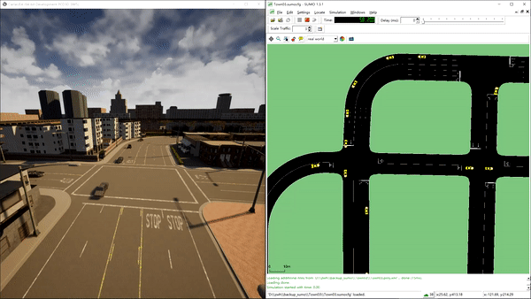

# TiEV-交通流注入联合仿真程序

## 1 总览

​	为了提高无人驾驶仿真场景中背景交通流的真实性，本项目实现无人驾驶仿真平台CARLA与微观交通流仿真系统SUMO之间的联合仿真程序，将SUMO中的背景车流注入到CARLA场景中并进行同步仿真。

## 2 基于间接控制车辆的交通流注入方法

### 2.1 概述

​	本节方法是项目创设初期提出的方法。由于联合仿真系统并不直接对仿真场景中的车辆进行控制，因此称之为间接控制车辆的注入方法。考虑到此类方法完全基于车辆客户端实现，因此支持的交通流注入规模较小。

### 2.2 效果展示


### 2.3 使用说明

``` shell
# 运行0.9.8版本的CARLA服务器程序，不在当前目录下
$ ./CarlaUE4.sh
# 运行交通流服务器程序
$ python SUMOServer/SUMO_Carla.py 
# 运行背景车客户端，根据需要运行多个
$ python Co-Simulation/background_client.py 
```


## 3 基于直接控制车辆的交通流注入方法

### 3.1 概述

​	CARLA官方在2020年3月发布的CARLA 0.9.8版本中加入了对SUMO联合仿真的支持。官方实现方法的核心思想是不经由车辆客户端，而直接从仿真场景的层次定时控制场景内所有车辆。这种方法支持的交通流规模非常大（但也会受到服务器端性能限制），但不支持客户端层级的控制方法。

### 3.2 效果展示



### 3.3 使用说明

``` shell
# 运行0.9.8版本的CARLA服务器程序，不在当前目录下
$ ./CarlaUE4.sh
# Windows环境运行交通流注入程序
$ ./Co-Simulation/injection.bat
# Linux环境运行交通流注入程序

```


## 4 基于混合控制车辆的交通流注入方法

### 4.1 概述

​	此处的混合控制方法实质上融合了直接控制方法的车辆控制方法，以及间接控制方法的双端交互框架，以此来实现客户端层面的控制支持，以模拟某些客户端所需控制的典型场景。

### 4.2 效果展示

​	此处展示的是嵌入混合控制框架的手动控制车辆控制前方背景车流避让的情形。


​	目前，混合控制方法中受交通流服务器直接控制的背景车客户端还存在不稳定的问题，并且由于这类车辆还会被交通流服务器视为受CARLA控制的车辆，因此会在车辆的同一位置自动生成重复车辆，如下图所示。


​	因此，这一问题还需要后续进行优化和解决。

### 4.3 使用说明

``` shell
# 运行0.9.8版本的CARLA服务器程序，不在当前目录下
$ ./CarlaUE4.sh
# Windows环境运行交通流服务器（基于直接方法的注入程序构建）
$ ./Co-Simulation/injection.bat
# 运行受交通流服务器直接控制的背景车客户端
$ python Co-Simulation/client_main.py
# 运行嵌入交互框架的手动控制客户端
$ python Co-Simulation/client_main.py --is-manual=True
# 手动控制的客户端按V键请求前方车辆避让
```


## 5 其他

### 5.1 根据OpenDrive路网文件自动生成SUMO仿真文件

​	我们构建了输入OpenDrive文件、输出.sumocfg、.trip.xml等仿真文件的脚本程序，程序具体的构建可见`SUMOServer/generate_simulation.sh`文件。这一脚本程序目前仅能在Unix环境下运行，后续可将其重写为.bat格式的Windows脚本文件。

​	然而，目前这一部分存在的问题是自动生成的旅程文件`.trip.xml`在实际的仿真过程中往往不能覆盖场景中全部的道路。对于这一问题，从`randomTrips.py`官方文档[randomTrips.py](https://sumo.dlr.de/docs/Tools/Trip.html)中找到了相关的说法：

> This task is performed by the router. If the network is not fully connected some of the trips may be discarded.

​	因此，这一部分还需要后续进一步的测试。